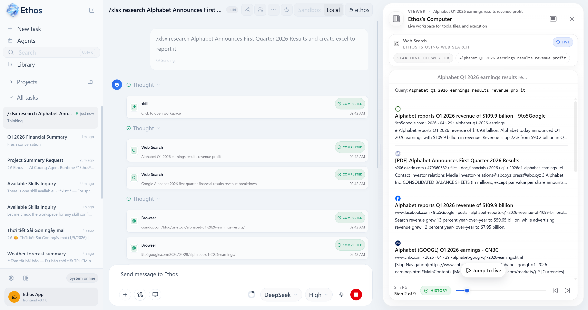
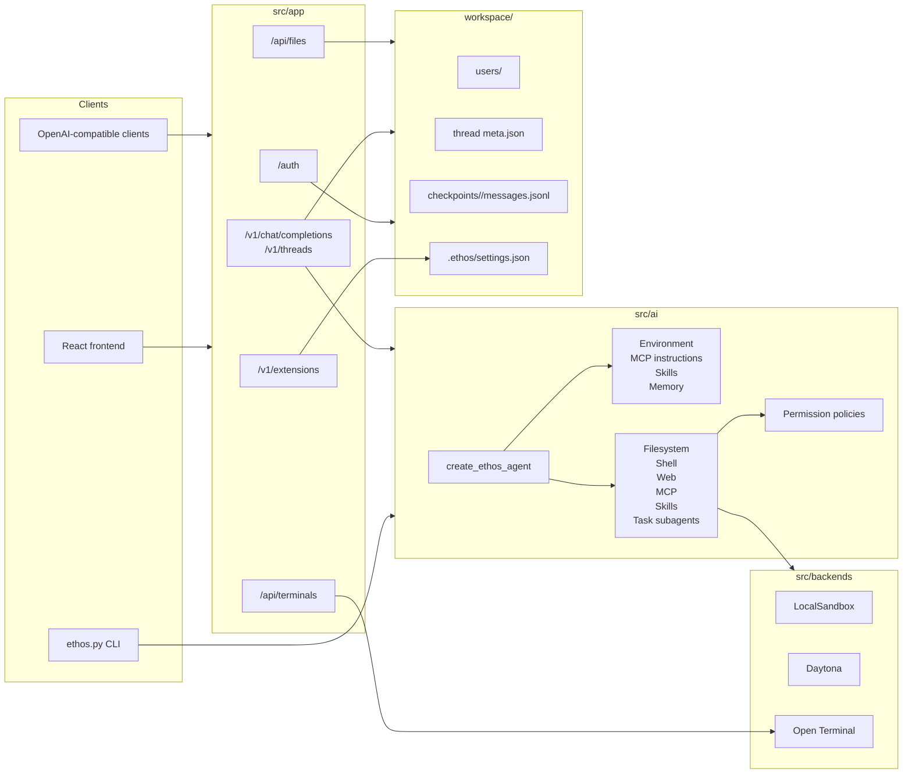

# Ethos

[](https://github.com/)
[](https://github.com/)
[](https://github.com/)

[Open the live app](https://ethos-frontend-inky.vercel.app/app)

<div style="display:flex;flex-wrap:wrap;gap:0.5rem;margin:0.9rem 0 1rem;">
  <span style="background:#ecfeff;color:#0f766e;border:1px solid #99f6e4;padding:0.3rem 0.7rem;border-radius:999px;font-weight:700;">Model</span>
  <span style="background:#eff6ff;color:#1d4ed8;border:1px solid #bfdbfe;padding:0.3rem 0.7rem;border-radius:999px;font-weight:700;">Tools</span>
  <span style="background:#f5f3ff;color:#6d28d9;border:1px solid #ddd6fe;padding:0.3rem 0.7rem;border-radius:999px;font-weight:700;">Skills</span>
  <span style="background:#eff6ff;color:#0369a1;border:1px solid #bae6fd;padding:0.3rem 0.7rem;border-radius:999px;font-weight:700;">MCP</span>
  <span style="background:#fffbeb;color:#b45309;border:1px solid #fde68a;padding:0.3rem 0.7rem;border-radius:999px;font-weight:700;">Memory</span>
  <span style="background:#fef2f2;color:#b91c1c;border:1px solid #fecaca;padding:0.3rem 0.7rem;border-radius:999px;font-weight:700;">Permissions</span>
  <span style="background:#f3e8ff;color:#7e22ce;border:1px solid #e9d5ff;padding:0.3rem 0.7rem;border-radius:999px;font-weight:700;">Streaming</span>
</div>

Ethos is a full-stack <span style="color:#0f766e;font-weight:800;">AI coding agent workspace</span>. It combines a <span style="color:#2563eb;font-weight:800;">LangGraph/LangChain</span> agent, <span style="color:#b91c1c;font-weight:800;">permission-aware</span> tools, local or sandboxed execution backends, an <span style="color:#b45309;font-weight:800;">OpenAI-compatible FastAPI API</span>, and a <span style="color:#7e22ce;font-weight:800;">React/Vite UI</span> for real-time coding workflows.

It is more than a chat wrapper. Ethos is a complete agent runtime: <span style="color:#1d4ed8;font-weight:800;">model/provider resolution</span>, <span style="color:#0f766e;font-weight:800;">streaming</span>, checkpoints, thread metadata, auth, <span style="color:#6d28d9;font-weight:800;">skills support</span>, <span style="color:#0369a1;font-weight:800;">MCP integration</span>, file uploads, terminal/file proxies, and a polished frontend all ship together.

In agent terminology, Ethos is an **AI agent harness**: the runtime layer that wraps an LLM with tools, context, memory, permissions, state persistence, and execution environments so it can do long-running, multi-step work.

## App Preview



Ethos gives the user one workspace for planning, coding, reviewing, running tools, managing projects, switching models, and approving agent actions.

## What Ethos Does

- Runs an agent with filesystem, web, shell, <span style="color:#6d28d9;font-weight:800;">skills</span>, <span style="color:#0369a1;font-weight:800;">MCP</span>, and subagent/task tools.
- Supports local projects and sandboxed execution backends.
- Streams text, reasoning, tool activity, permission requests, and run ids through an OpenAI-compatible API.
- Persists user sessions, thread metadata, permission overlays, and message/checkpoint history on disk.
- Provides a React frontend with profiles, model selection, project/thread management, attachments, permissions, settings, i18n, and a workspace activity panel.
- Lets users configure <span style="color:#6d28d9;font-weight:800;">skills</span> and <span style="color:#0369a1;font-weight:800;">MCP servers</span> from the app or from workspace settings.

## Why Ethos Is an Agent Harness

A useful shorthand is:

```text
Agent = Model + Harness
```

The **model** produces reasoning and tool-call intent. The **harness** is the surrounding system that turns that intent into reliable work: it assembles context, routes tool calls, executes actions, enforces permissions, persists state, recovers from interruptions, and connects the agent to real environments.

Ethos fits that definition:

| Harness capability | Ethos implementation |
| --- | --- |
| Agentic loop | LangGraph/LangChain agent created by `src/ai/agents/ethos.py` |
| Tool system | Filesystem, shell, web, <span style="color:#0369a1;font-weight:800;">MCP</span>, <span style="color:#6d28d9;font-weight:800;">skills</span>, interaction, and task/subagent tools |
| Context assembly | Environment, <span style="color:#0369a1;font-weight:800;">MCP instructions</span>, <span style="color:#6d28d9;font-weight:800;">skills</span>, and memory middleware |
| Memory and state | Thread metadata plus async JSONL checkpoints under `workspace/checkpoints/` |
| Guardrails | Permission modes, rule overlays, <span style="color:#0369a1;font-weight:800;">MCP policy</span>, filesystem/shell policies |
| Execution environment | LocalSandbox, Daytona, and Open Terminal backends |
| Human-in-the-loop | Structured permission requests, ask-user prompts, run stop/resume |
| UI/runtime | FastAPI streaming API plus React workspace frontend |

So, yes: Ethos is a harness-style AI coding agent runtime, built on top of LangGraph/LangChain rather than replacing them. LangGraph/LangChain provide framework primitives; Ethos is the deployable harness that wires those primitives into a usable coding-agent workspace.

Further reading:

- [OpenAI: Harness engineering](https://openai.com/index/harness-engineering/)
- [OpenAI: Symphony and Codex orchestration](https://openai.com/index/open-source-codex-orchestration-symphony/)
- [SafeHarness paper: execution harness as tool/context/state layer](https://arxiv.org/abs/2604.13630)
- [Harness Guide: What is a harness?](https://harness-guide.com/guide/what-is-harness/)

## Stack

| Layer | Technology |
| --- | --- |
| Agent | LangGraph, LangChain `create_agent` |
| API | FastAPI, Uvicorn, SSE streaming |
| Models | OpenRouter, OpenAI, Anthropic, Azure OpenAI, DeepSeek, Together, Groq, xAI, Fireworks, Perplexity, Google GenAI, Bedrock, custom OpenAI-compatible endpoints |
| Storage | Local JSON files plus async JSONL LangGraph checkpoints |
| Frontend | React 19, Vite 6, TypeScript, Tailwind v4, i18next, Monaco, Shiki |
| Tests | pytest, pytest-asyncio, httpx |
| Deployment | Docker Compose for local full-stack runs |

## Architecture



## Repository Layout

```text
.
|-- ethos.py                     # CLI entry point and LangGraph graph factory
|-- main.py                      # FastAPI server entry point
|-- langgraph.json               # LangGraph dev configuration
|-- pyproject.toml               # Python dependencies and pytest config
|-- docker-compose.yml           # Backend + frontend local stack
|-- src/
|   |-- ai/
|   |   |-- agents/              # Main agent factory and subagents
|   |   |-- filesystem/          # Local filesystem service layer
|   |   |-- middleware/          # Environment, MCP instructions, skills, memory
|   |   |-- permissions/         # Read/edit/shell/skill/MCP policies
|   |   |-- prompts/             # Base system prompt catalog
|   |   |-- skills/              # Skill discovery/rendering
|   |   `-- tools/               # Agent tools
|   |-- app/
|   |   |-- core/                # API settings/logging
|   |   |-- modules/             # Auth, chat, extensions, files, terminals
|   |   `-- services/            # Checkpoints, thread store, permissions, tasks
|   |-- backends/                # Local, Daytona, Open Terminal, protocol
|   `-- logger/                  # Logging helpers
|-- frontend/
|   `-- src/                     # React UI, components, hooks, utils, locales
|-- docs/                        # Architecture, permissions, storage, frontend rules
|-- tests/                       # pytest suite mirroring source areas
`-- workspace/                   # Default local runtime data, gitignored
```

## Quick Start

### 1. Install backend dependencies

```bash
uv sync --all-groups
```

### 2. Configure environment

```bash
cp .env.example .env
```

Add at least one model provider key:

```bash
OPENROUTER_API_KEY=...
# or ANTHROPIC_API_KEY=...
# or OPENAI_API_KEY=...
```

### 3. Run the API

```bash
python main.py
```

The API listens on `http://localhost:8080` by default.

### 4. Run the frontend

```bash
cd frontend
npm install
npm run dev
```

The Vite dev server usually runs at `http://localhost:5173`.

## Running Modes

### CLI

```bash
python ethos.py
python ethos.py --sandbox
python ethos.py --daytona
python ethos.py --open-terminal
```

Current CLI behavior defaults to the Open Terminal mode unless another mutually exclusive mode is passed. Open Terminal mode requires `OPEN_TERMINAL_API_KEY`.

### API

```bash
python main.py
```

Useful endpoints:

| Endpoint | Purpose |
| --- | --- |
| `GET /v1/models` | OpenAI-style model list |
| `POST /v1/chat/completions` | Chat completions, streaming or non-streaming |
| `POST /v1/threads` | Create a thread |
| `GET /v1/threads` | List user threads with persisted messages |
| `GET/PATCH /v1/threads/{id}/permissions` | Thread permission overlay |
| `GET/PUT /auth/me/permissions` | User default permission profile |
| `GET/POST /v1/extensions/*` | Skills and MCP settings |
| `POST /api/files/` | Managed file uploads |
| `GET /api/terminals/*` | Open Terminal proxy routes |

### LangGraph Dev

```bash
langgraph dev
```

The graph entry is configured in `langgraph.json`.

### Docker Compose

```bash
# Linux/macOS
./start-dev.sh

# Windows
start-dev.bat
```

Compose starts:

| Service | Port |
| --- | --- |
| `ethos-backend` | `8080` |
| `ethos-frontend` | `3000` |

## Model Configuration

Single-model mode:

```bash
ETHOS_PROVIDER=openrouter
ETHOS_MODEL=openai/gpt-4o-mini
```

Multiple-model registry:

```bash
ETHOS_MODEL_REGISTRY='[
  {"id":"ethos","provider":"openrouter","model":"openai/gpt-4o-mini"},
  {"id":"claude","provider":"anthropic","model":"claude-3-5-sonnet-latest"}
]'
```

Supported provider ids include:

`openrouter`, `openai`, `anthropic`, `deepseek`, `together`, `groq`, `xai`, `fireworks`, `perplexity`, `google_genai`, `bedrock`, `azure_openai`, and `openai_compatible`.

Profiles in the frontend can also send per-request provider settings, API keys, reasoning options, base URLs, deployments, API versions, and model kwargs.

## Workspaces, Skills, and MCP

The agent workspace defaults to `./workspace`:

```bash
ETHOS_WORKSPACE=./workspace
ETHOS_WORKSPACE_DIR=./workspace
```

Skill discovery priority:

1. `.ethos/skills/<name>/SKILL.md`
2. `<user-home>/.ethos/skills/<name>/SKILL.md`

MCP servers can be configured with `ETHOS_MCP_SERVERS` or in:

```text
<workspace>/.ethos/settings.json
```

Example:

```json
{
  "mcpServers": {
    "docs": {
      "transport": "streamable_http",
      "url": "https://example.com/mcp",
      "instructions": "Use this server for project documentation."
    }
  }
}
```

Ethos exposes first-class MCP tools named like `mcp__server__tool` when schemas can be discovered, with a generic MCP fallback when needed.

## Permissions

Permissions are built around a user default profile plus per-thread overlay:

- Modes: `default`, `accept_edits`, `bypass_permissions`, `dont_ask`
- Subjects: `read`, `edit`, `bash`, `powershell`, `skill`, `mcp`
- Behaviors: `allow`, `ask`, `deny`

Permission-sensitive tools can pause runs with structured approval requests. The frontend can approve once, approve for the chat, bypass for the chat, or resume after user input.

Relevant docs:

- `docs/PERMISSIONS_GUIDE.md`
- `docs/PERMISSIONS_FLOW.md`
- `docs/PERMISSIONS_COMPARISON.md`

## Storage

Ethos is local-first and file-based by default:

```text
workspace/
|-- users/
|   `-- <user_id>/
|       |-- profile.json
|       |-- sessions/<token_hash>.json
|       `-- threads/<thread_id>/meta.json
|-- checkpoints/
|   `-- checkpoints/<thread_id>/
|       |-- messages.jsonl
|       `-- checkpoint_state.jsonl
|-- managed_files/
`-- .ethos/settings.json
```

Highlights:

- Guest sessions use hashed tokens and sliding TTL.
- Thread metadata is stored one directory per thread.
- LangGraph checkpoints and Claude-style message audit history are persisted as JSONL.
- Legacy storage migration exists for older security/thread layouts.

## Frontend Notes

The frontend lives in `frontend/src` and includes:

- Chat, composer, thread sidebar, project grouping, favorites, rename/delete.
- Provider profiles and model settings.
- Security/permission settings.
- Extensions settings for local skills and MCP servers.
- Workspace views for files, search results, terminal, browser-like previews, and tool activity.
- i18n locale files in `frontend/src/locales`.

Before changing frontend code, read `docs/FRONTEND_RULES.md`. User-facing text must use `react-i18next`, and theme-aware styles must use the existing CSS variables in `frontend/src/styles.css`.

## Tests

Run all tests:

```bash
uv run pytest
```

Run focused suites:

```bash
uv run pytest tests/permissions -v
uv run pytest tests/tools -v
uv run pytest tests/test_thread_source_of_truth.py -v
uv run pytest tests/test_async_jsonl_checkpointer.py -v
```

Frontend build:

```bash
cd frontend
npm run build
```

## Contributor Notes

- Match existing Python and TypeScript style. There is no repo-wide formatter config.
- Keep backend behavior consistent across local, Daytona, and Open Terminal paths.
- Treat permission, filesystem, terminal, streaming, and checkpoint changes as high-risk and test them directly.
- Keep secrets out of git. Use `.env.example` for shape, `.env` for local values.
